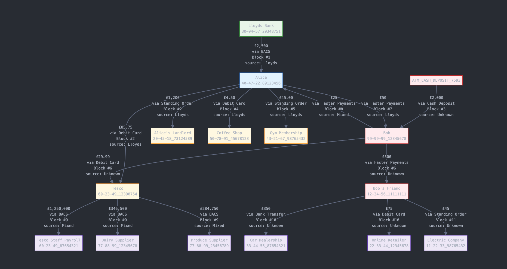

# Banking Blockchain Transaction Tracking System

## Overview

A simplified blockchain implementation for tracking financial transactions within banking systems. This private blockchain focuses on transaction tracking, source attribution, and anti-money laundering capabilities.

If you're new to blockchain. Imagine a LinkedList of transactions (known as blocks). Each block has a reference to the previous block's hash, creating an immutable chain where money's source can be traced through the entire transaction history.

This is a POC to show how blockchain can help banks audit transactions by linking with other accounts and schemes to identify potential fraud/money laundering by primarily highlighting the movement of money from untraceable streams e.g. cash. Tests have been omitted as I've used bash scripts for simulating traffic, if you plan to fork this repo, add tests...



## Key Features

- **Transaction Tracking:** Records financial transactions with account details
- **Source Attribution:** Tracks the original source of funds through multiple transactions
- **Money Trail Analysis:** Traces money flow through the system
- **AML Detection:** Identifies suspicious transactions
- **RESTful API:** Easy integration with existing banking systems

## How It Works

### Quick Use
I've created a few bash scripts to simulate traffic and view the blockchain. 
- [Simulate Traffic](simulate.sh)
- [Visual Blockchain](visual-blockchain.sh)

### Basic Concepts

The system uses a chain of blocks to record transactions. Each block contains:
- A group of transactions
- A timestamp
- A cryptographic hash (digital fingerprint)
- A link to the previous block

This creates a connected chain where changing any data would break the links.

### Transaction Details

Each transaction stores:
- Sender (sort code + account number)
- Receiver (sort code + account number)
- Amount
- Payment scheme (BACS, Faster Payments, etc.)
- Original source of funds
- Timestamp

### Source Tracking

When a bank sends money to an account, that money is tagged with the bank's ID. When the customer spends that money, the new transaction maintains the original source tag. This creates a full trail showing where all money originated.

### Simplified for Banking

Unlike Bitcoin which uses resource-intensive mining, this system is designed for internal banking use:
- No mining required
- Faster transaction processing
- Lower resource requirements
- Full transaction visibility for the bank

## API Endpoints

Simple API for integration:

- `GET /chain` - View the blockchain
- `POST /transactions` - Create a transaction
- `POST /mine` - Create a new block
- `GET /trace` - Follow money through the system
- `GET /accounts/{id}/transactions` - View account activity
- `POST /suspicious` - Find potential money laundering

## Scaling for Production

This blockchain can scale to handle banking transaction volumes:

- Can run across multiple servers
- No complex mining means better performance
- Works with existing database systems
- Supports thousands of transactions per second

## Example Usage

### Creating a transaction
```bash
curl -X POST http://localhost:8080/api/blockchain/transactions \
  -H "Content-Type: application/json" \
  -d '{
    "sender": "30-94-57_20348751",
    "receiver": "40-47-22_89123456",
    "amount": 2500.00,
    "paymentScheme": "BACS",
    "source": "30-94-57_20348751"
  }'